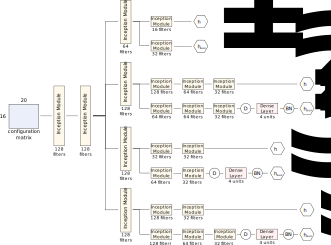

# AI for CICY 4-folds

H. Erbin (MIT), R. Finotello (CEA Paris-Saclay), R. Schneider (Uppsala U.), M. Tamaazousti (CEA Paris-Saclay)

Code: [R. Finotello](https://thesfinox.github.io/)

See also R. Schneider's [repo](https://github.com/robin-schneider/cicy-fourfolds) for additional material such as classification tasks and hyperparameter optimisation.

## Abstract

We continue earlier efforts in computing the dimensions of tangent space cohomologies of Calabi-Yau (CY) manifolds using deep learning.
In this paper, we consider the dataset of all CY four-folds constructed as complete intersections (CICY) in products of projective spaces.
Employing neural networks inspired from state-of-the-art computer vision architectures, we introduce the model *CICYMiner* and we improve earlier benchmarks and demonstrate that all four non-trivial Hodge numbers can be learned at the same time using a multi-task regression architecture.

## Requirements

Requirements are specified in [requirements.yml](./requirements.yml) for a [Conda](https://www.anaconda.com/) environment using Python 3.6 and [Tensorflow](https://www.tensorflow.org/) 2.1.
Use the command `conda env create -n cicy -f requirements.yml` (see also [here](https://docs.conda.io/projects/conda/en/latest/user-guide/tasks/manage-environments.html#building-identical-conda-environments)) to build an identical virtual environment on your local machine.

## Usage Tips

The CICY dataset can be found [here](http://www-thphys.physics.ox.ac.uk/projects/CalabiYau/Cicy4folds/index.html), and the original papers [here](http://arxiv.org/abs/1303.1832) and [here](http://arxiv.org/abs/1405.2073).

Use [sets.py](./sets.py) to create training, validation and test sets according to your needs (use `python sets.py - h` for the list of options).

For hyperparameter optimisation with a grid search, use [grid.py](./grid.py) to form a JSON file with all possible hyperparameter options.
Use `python grid.py -h` for the complete list of options.
The list of choices should be specified in a JSON formatted file such as [parameters.json](./parameters.json) and passed to [grid.py](./grid.py) (each parameter is a list of lists, in order to form the grid search)

Files `cicy_*.py` perform the training and inference tasks.
Use `python cicy.py -h` for a list of options.
Specifically, [cicy.py](./cicy.py) performs the training on a single branch architecture, [cicy_diff.py](./cicy_diff.py) uses a multi-task architecture to compute all four Hodge numbers at once, [cicy_diff_ablation.py](./cicy_diff_ablation.py) performs an in-depth ablation study with respect to other architectures provided as hyperparameter choices.

